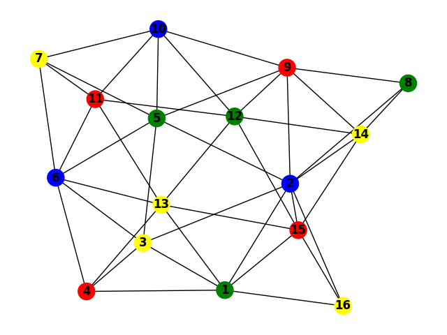
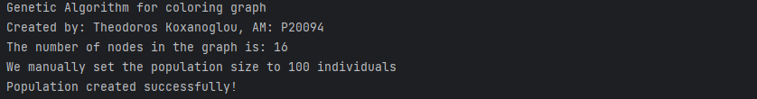
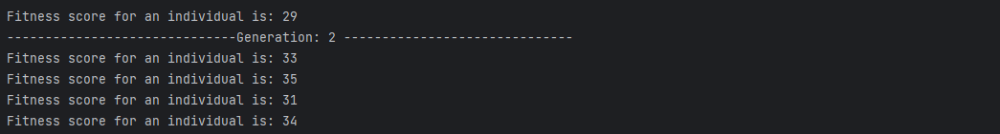
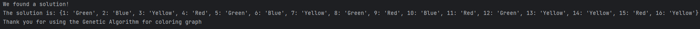

# Artificial Intelligence and Expert Systems (2023) - Graph Coloring using Genetic Algorithms

## Project Overview

This project is an individual assignment for the "Artificial Intelligence and Expert Systems" course, offered in the 6th semester of the 2023 academic year at the University of Piraeus, Department of Informatics. The project focuses on solving the graph coloring problem using genetic algorithms. The goal is to develop a Python program that colors the given graph using four colors: Red, Green, Blue, and Yellow. The graph coloring must satisfy the constraint that no two adjacent nodes share the same color.

## Course Information

- **Institution:** University of Piraeus
- **Department:** Department of Informatics
- **Course:** Artificial Intelligence and Expert Systems (2023)
- **Semester:** 6th

## Technologies Used

- Python
- **Libraries:**
  - `random`: For generating random numbers.
  - `networkx`: For handling graph structures.
  - `matplotlib`: For visualizing the graph with colored nodes.

### Genetic Algorithm Implementation

The genetic algorithm implemented in this project includes the following steps:

1. **Initialization**: Generate a random initial population of potential solutions (colorings of the graph).
2. **Fitness Evaluation**: Calculate the fitness of each individual in the population. The fitness score represents the number of edges whose adjacent nodes are colored differently.
3. **Parent Selection**: Select parent individuals for reproduction using the roulette wheel selection technique, giving higher chances to individuals with better fitness scores.
4. **Crossover and Mutation**: Generate new individuals (children) through crossover and mutation operations. Crossover is performed with a single-point crossover technique, and mutation is applied to a small percentage of the population.
5. **Generation of New Population**: Replace the old population with the newly generated children and repeat the process until an optimal solution is found or a predetermined number of generations is reached.

### Graph Details

The graph used in this project consists of 16 nodes, with specific connections between them. The goal is to color this graph using the genetic algorithm.

## Project Structure

The repository is structured as follows:

```
/solution.py                     # Main script implementing the genetic algorithm for graph coloring
/docs
    /Project-description.pdf     # Description of the project
    /Project-documentation.pdf   # Detailed documentation of the code and algorithm
```

- **`/docs`**: Includes the project description and detailed documentation.

## Usage Instructions

### Running the Genetic Algorithm

To run the genetic algorithm for graph coloring, execute the following script:

```bash
python solution.py
```

This script will generate a random population, evaluate fitness scores, perform selection, crossover, and mutation, and continue through generations until an optimal coloring solution is found or the maximum number of generations is reached.

### Example Output

Upon successful execution, the script will display the following:

1. The progression of generations and their respective best fitness scores.
2. The final solution found by the genetic algorithm, showing the coloring of the graph.
3. A graphical representation of the graph with nodes colored according to the solution found.

- **Graph Visualization**:
  
  

- **Generation Messages**:
  
  
  

- **Solution Found**:
  

## Setup Instructions

1. **Clone the repository**

2. **Install the required libraries**

3. **Run the script**:

    Follow the usage instructions to execute the genetic algorithm.

## Project Documentation

For detailed explanations of the code and algorithm, refer to the `Project-documentation.pdf` located in the `/docs` directory. This document provides a thorough analysis of the genetic algorithm steps, including initialization, fitness evaluation, parent selection, crossover, mutation, and generation of new populations.

## License

This project is licensed under the MIT License - see the [LICENSE](./LICENSE) file for details.
